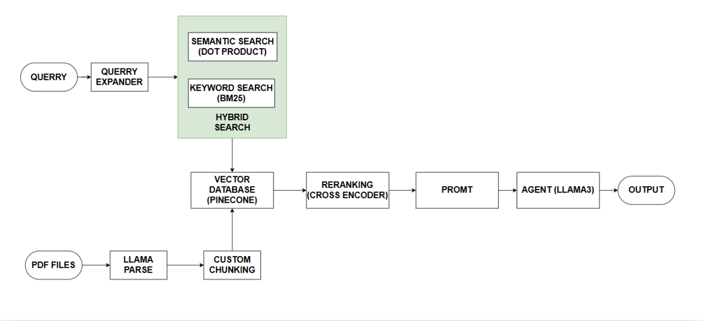

# 🧠 Social Science RAG Chatbot

A retrieval-augmented generation (RAG) chatbot designed to assist students in a Social Science class. It leverages hybrid search, PDF document parsing, and reranking techniques to provide accurate and contextually relevant answers.

# Core Features
- **Hybrid Search**: Combines keyword + semantic search via Pinecone.
- **Query Expansion**: Rephrase the query for better search 
- **Structured Chunking**: Use LlamaIndex to parse as markdown, and chunk into sections
- **Chat Interface**: Powered by LangChain and LLaMA3.
- **Reranking**: Cross-Encoder to rerank retrieved contexts.
- **Context-Aware Answers**: Uses RAG pipeline to answer queries with citations.

#How to set up:
-Download [Ollama](https://ollama.com/)
-Run `ollama pull llama3`
-Add to your .env file:
`LLAMA_CLOUD_API_KEY=your_key`
`PINECONE_API_KEY=your_key`
-Install dependencies with `pip install -r requirements.txt`

#how to run: `streamlit run main.py`
